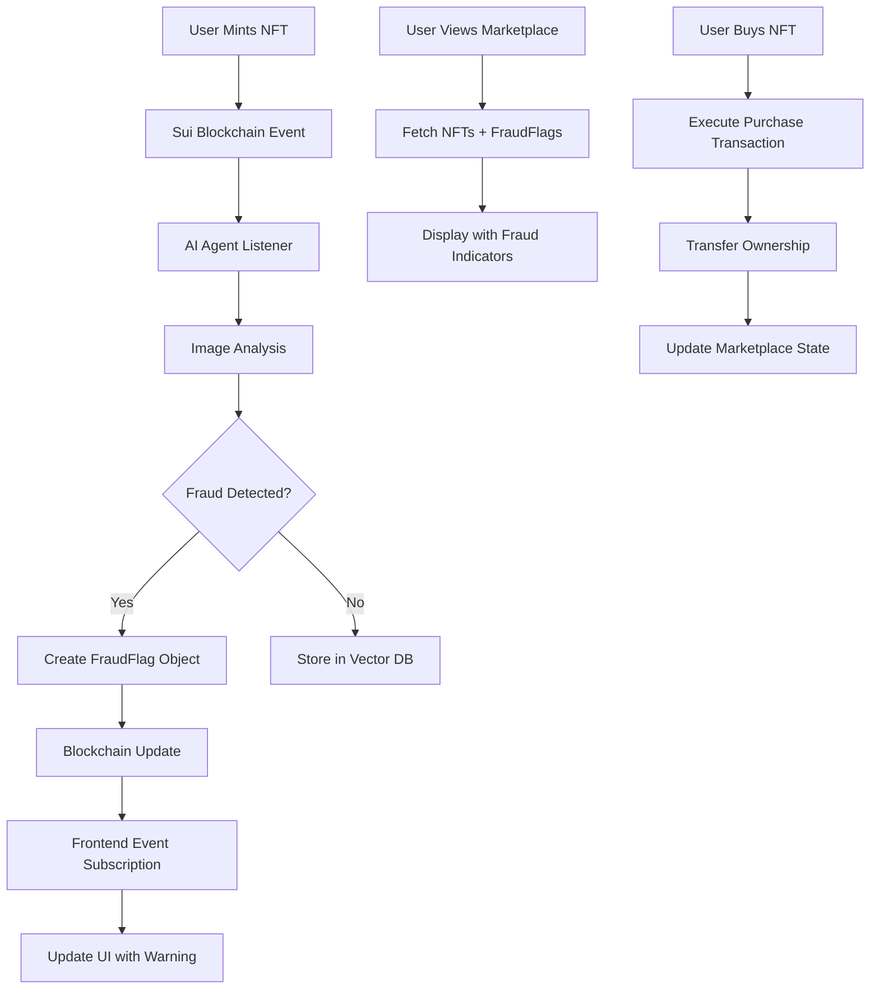
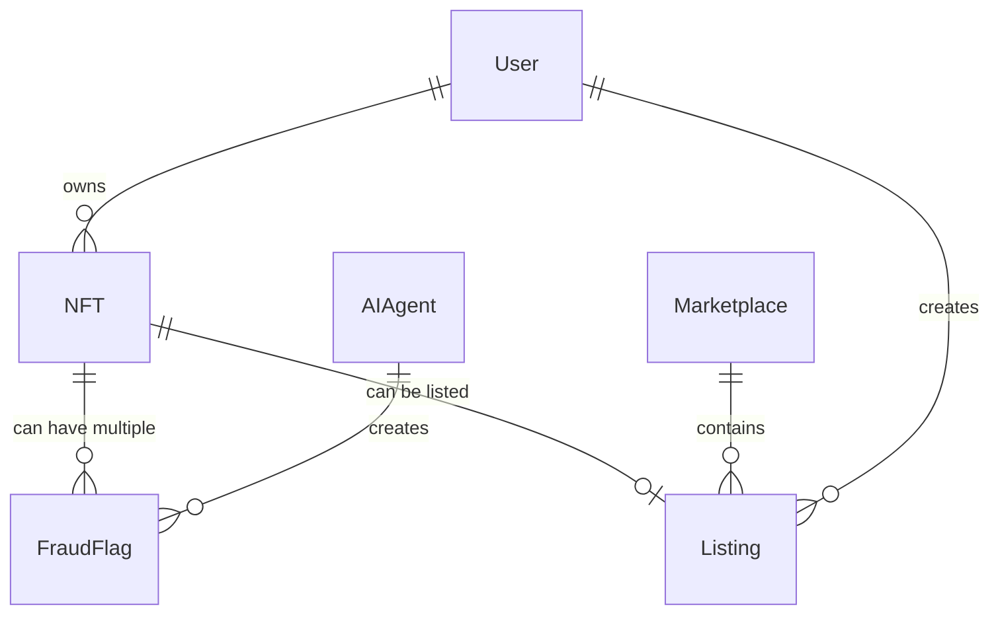

# 🔗 Sui Blockchain Flow Plan for FraudGuard

Based on your existing project structure and the comprehensive frontend implementation, here's a detailed plan for the Sui blockchain integration:

## **🏗️ Sui Blockchain Architecture Overview**

### **Core Components**
1. **Smart Contracts (Move modules)**
2. **Object Model Design**
3. **Frontend Integration**
4. **AI Agent Integration**
5. **Event Listening & Real-time Updates**

---

## **📋 1. Smart Contract Architecture**

### **Module Structure Plan**
```
sui/sources/
├── marketplace.move     # Core marketplace logic
├── nft.move            # NFT creation and management
├── fraud_flag.move     # Fraud detection flags
└── admin.move          # Admin functions (optional)
```

### **Object Model Design**

#### **NFT Object**
```move
struct NFT has key, store {
    id: UID,
    name: String,
    description: String,
    image_url: String,
    creator: address,
    price: u64,
    is_listed: bool,
    created_at: u64,
    metadata: vector<u8>, // JSON metadata
}
```

#### **Marketplace Object**
```move
struct Marketplace has key {
    id: UID,
    admin: address,
    fee_percentage: u64, // e.g., 250 = 2.5%
    total_volume: u64,
    total_sales: u64,
}
```

#### **FraudFlag Object**
```move
struct FraudFlag has key, store {
    id: UID,
    nft_id: ID,
    flag_type: u8, // 1=plagiarism, 2=suspicious_activity, 3=fake
    confidence_score: u64, // 0-100
    reason: String,
    flagged_by: address, // AI agent address
    flagged_at: u64,
    is_active: bool,
}
```

#### **Listing Object**
```move
struct Listing has key, store {
    id: UID,
    nft_id: ID,
    seller: address,
    price: u64,
    listed_at: u64,
    is_active: bool,
}
```

---

## **📝 2. Smart Contract Functions Plan**

### **Marketplace Module Functions**

#### **Public Entry Functions**
```move
// Initialize marketplace
public entry fun create_marketplace(ctx: &mut TxContext)

// List NFT for sale
public entry fun list_nft(
    marketplace: &mut Marketplace,
    nft: NFT,
    price: u64,
    ctx: &mut TxContext
)

// Buy NFT
public entry fun buy_nft(
    marketplace: &mut Marketplace,
    listing: Listing,
    payment: Coin<SUI>,
    ctx: &mut TxContext
)

// Cancel listing
public entry fun cancel_listing(
    marketplace: &mut Marketplace,
    listing: Listing,
    ctx: &mut TxContext
)
```

### **NFT Module Functions**

```move
// Mint new NFT
public entry fun mint_nft(
    name: String,
    description: String,
    image_url: String,
    metadata: vector<u8>,
    ctx: &mut TxContext
)

// Transfer NFT
public entry fun transfer_nft(
    nft: NFT,
    recipient: address,
    ctx: &mut TxContext
)
```

### **FraudFlag Module Functions**

```move
// Create fraud flag (AI agent only)
public entry fun create_fraud_flag(
    nft_id: ID,
    flag_type: u8,
    confidence_score: u64,
    reason: String,
    ctx: &mut TxContext
)

// Deactivate fraud flag
public entry fun deactivate_fraud_flag(
    flag: &mut FraudFlag,
    ctx: &mut TxContext
)
```

---

## **🔄 3. Frontend-Blockchain Integration Flow**

### **Wallet Connection Flow**
```typescript
// lib/sui.ts - Enhanced configuration
import { createNetworkConfig, SuiClientProvider } from '@mysten/dapp-kit';

const networkConfig = createNetworkConfig({
  testnet: { url: 'https://fullnode.testnet.sui.io:443' },
  mainnet: { url: 'https://fullnode.mainnet.sui.io:443' }
});

// Contract addresses (after deployment)
export const CONTRACTS = {
  MARKETPLACE: '0x...', // Marketplace package ID
  NFT_MODULE: '0x...::nft',
  FRAUD_MODULE: '0x...::fraud_flag'
};
```

### **Key Frontend Hooks Enhancement**

#### **useSuiNfts.ts - Enhanced**
```typescript
export function useSuiNfts() {
  const { data: nfts } = useQuery({
    queryKey: ['sui-nfts'],
    queryFn: async () => {
      // 1. Fetch NFT objects from Sui
      const nftObjects = await suiClient.getOwnedObjects({
        owner: walletAddress,
        filter: { StructType: `${CONTRACTS.NFT_MODULE}::NFT` }
      });

      // 2. Fetch fraud flags for each NFT
      const nftsWithFraudData = await Promise.all(
        nftObjects.map(async (nft) => {
          const fraudFlags = await fetchFraudFlags(nft.data.objectId);
          return { ...nft, fraudFlags };
        })
      );

      return nftsWithFraudData;
    }
  });
}
```

#### **useMarketplace.ts - New Hook**
```typescript
export function useMarketplace() {
  const buyNft = useMutation({
    mutationFn: async ({ listingId, price }: BuyNftParams) => {
      const txb = new TransactionBlock();

      // 1. Get listing object
      const listing = txb.object(listingId);

      // 2. Create payment coin
      const [coin] = txb.splitCoins(txb.gas, [txb.pure(price)]);

      // 3. Call buy_nft function
      txb.moveCall({
        target: `${CONTRACTS.MARKETPLACE}::buy_nft`,
        arguments: [marketplace, listing, coin]
      });

      return await signAndExecuteTransactionBlock({ transactionBlock: txb });
    }
  });
}
```

### **Real-time Data Synchronization**

#### **Event Subscription System**
```typescript
// hooks/useSuiEvents.ts
export function useSuiEvents() {
  useEffect(() => {
    const subscribeToEvents = async () => {
      // Subscribe to NFT minting events
      await suiClient.subscribeEvent({
        filter: {
          Package: CONTRACTS.MARKETPLACE
        },
        onMessage: (event) => {
          if (event.type.includes('NFTMinted')) {
            // Trigger AI fraud detection
            triggerFraudDetection(event.parsedJson);
          }

          if (event.type.includes('FraudFlagCreated')) {
            // Update frontend fraud indicators
            updateFraudIndicators(event.parsedJson);
          }
        }
      });
    };

    subscribeToEvents();
  }, []);
}
```

---

## **🤖 4. AI Agent-Blockchain Integration**

### **Backend Agent Architecture**

#### **Event Listener (backend/agent/listener.py)**
```python
import asyncio
from sui_sdk import SuiClient
from .fraud_detector import FraudDetector
from .blockchain_writer import BlockchainWriter

class SuiEventListener:
    def __init__(self):
        self.sui_client = SuiClient("https://fullnode.testnet.sui.io:443")
        self.fraud_detector = FraudDetector()
        self.blockchain_writer = BlockchainWriter()

    async def listen_for_nft_events(self):
        """Listen for new NFT minting events"""
        async for event in self.sui_client.subscribe_event({
            "Package": MARKETPLACE_PACKAGE_ID
        }):
            if "NFTMinted" in event.type:
                await self.process_new_nft(event.parsed_json)

    async def process_new_nft(self, nft_data):
        """Process newly minted NFT for fraud detection"""
        # 1. Download and analyze image
        fraud_result = await self.fraud_detector.analyze_nft(nft_data)

        # 2. If fraud detected, create on-chain flag
        if fraud_result.is_fraud:
            await self.blockchain_writer.create_fraud_flag(
                nft_id=nft_data.id,
                flag_type=fraud_result.flag_type,
                confidence=fraud_result.confidence,
                reason=fraud_result.reason
            )
```

#### **Blockchain Writer (backend/agent/blockchain_writer.py)**
```python
from sui_sdk import SuiClient, TransactionBlock

class BlockchainWriter:
    def __init__(self):
        self.sui_client = SuiClient()
        self.agent_keypair = load_agent_keypair()  # AI agent's wallet

    async def create_fraud_flag(self, nft_id, flag_type, confidence, reason):
        """Create fraud flag on-chain"""
        txb = TransactionBlock()

        txb.move_call(
            target=f"{FRAUD_MODULE}::create_fraud_flag",
            arguments=[
                txb.pure(nft_id),
                txb.pure(flag_type),
                txb.pure(confidence),
                txb.pure(reason)
            ]
        )

        result = await self.sui_client.sign_and_execute_transaction_block(
            transaction_block=txb,
            signer=self.agent_keypair
        )

        return result
```

---

## **📊 5. Data Flow Architecture**

### **Complete System Flow**



### **Object Relationship Model**



---

## **🔧 6. Implementation Priority & Timeline**

### **Phase 1: Core Smart Contracts (Day 1)**
1. ✅ Set up Move.toml with proper dependencies
2. ✅ Implement NFT module with basic minting
3. ✅ Implement Marketplace module with listing/buying
4. ✅ Deploy to Sui testnet
5. ✅ Test basic functionality

### **Phase 2: Fraud Detection Integration (Day 2)**
1. ✅ Implement FraudFlag module
2. ✅ Create AI agent wallet and fund it
3. ✅ Implement LangGraph-based fraud detection workflow with Google Gemini
4. ✅ Clean backend architecture without mock code
5. ✅ Google API key integration with LangChain
6. ✅ Simplified, production-ready backend structure
7. ✅ Test end-to-end fraud flagging with LangGraph

### **Phase 3: Frontend Integration (Day 3)**
1. ✅ Update frontend hooks to use real Sui data
2. ✅ Implement real wallet transactions
3. ✅ Add real-time event subscriptions
4. ✅ Test complete user flows
5. ✅ Polish and optimize

---

## **🎯 Key Integration Points**

### **Frontend ↔ Blockchain**
- **Wallet Connection**: Sui Wallet, Ethos, Suiet support
- **Transaction Signing**: All marketplace operations
- **Real-time Updates**: Event subscriptions for live data
- **Error Handling**: Network issues, transaction failures

### **AI Agent ↔ Blockchain**
- **Event Monitoring**: Listen for new NFT mints
- **Fraud Flag Creation**: Automated on-chain flagging
- **Data Reading**: Access NFT metadata for analysis
- **Gas Management**: Efficient transaction batching

### **Security Considerations**
- **AI Agent Permissions**: Limited to fraud flagging only
- **User Safety**: Non-blocking fraud warnings
- **Data Integrity**: Immutable fraud detection records
- **Access Control**: Proper ownership verification

This plan creates a robust, scalable Sui blockchain integration that supports your FraudGuard marketplace vision while maintaining the excellent frontend experience you've already built. The modular design allows for iterative development and easy testing during the hackathon.